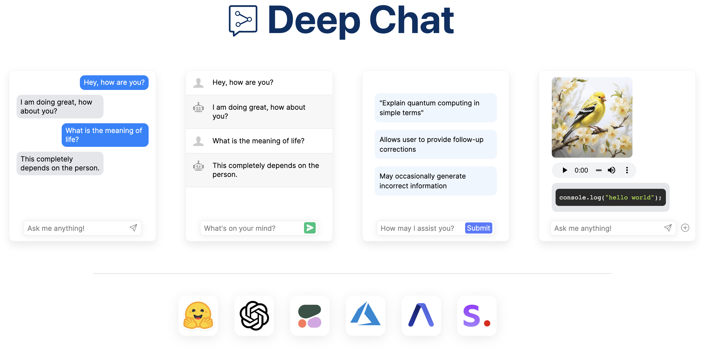
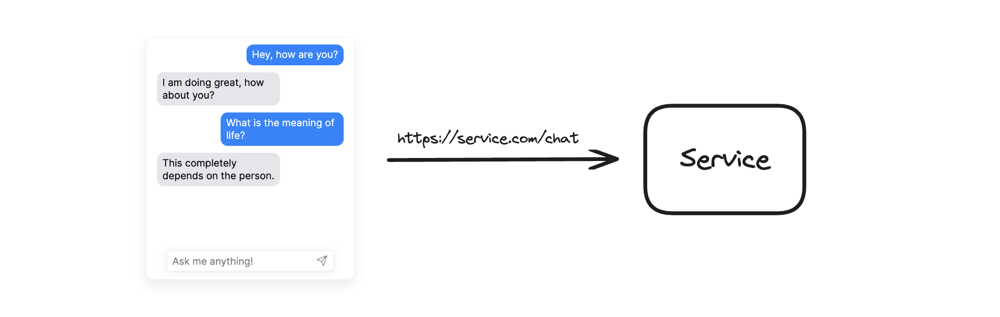

:warning: Note from developer (05/10/2024): :warning:

:airplane: I have recently relocated to another country and am currently focusing on settling into my new home and sorting out various logistics. As a result, progress on new features for Deep Chat has slowed down, and I apologize for the delays in responding to issues.

:heart: Deep Chat has been one of my most rewarding projects, and I’m eager to get back to my usual development pace as soon as possible. Thank you for your understanding and patience during this time.

<br />



<b>Deep Chat</b> is a fully customizable AI chat component that can be injected into your website with minimal to no effort. Whether you want to create a chatbot that leverages popular APIs such as ChatGPT or connect to your own custom service, this component can do it all! Explore [deepchat.dev](https://deepchat.dev/) to view all of the available features, how to use them, examples and more!

### :rocket: Main Features

- Connect to any API
- Avatars
- Names
- Send/Receive files
- Capture photos via webcam
- Record audio via microphone
- Speech To Text for message input
- Text To Speech to hear message responses
- Support for MarkDown and custom elements to help structure text and render code
- Introduction panel and dynamic modals to help describe functionality for your users
- Connect to popular AI APIs such as OpenAI, HuggingFace, Cohere directly from the browser
- Support for all major ui frameworks/libraries
- Host a model on the browser
- Everything is customizable!

### :tada: :tada: 2.0 is now available :tada: :tada:

Announcing Deep Chat 2.0! We have redesigned and improved Deep Chat based on all of your generous feedback. It is now much easier to implement into any website and configure to provide the best possible chat experience for your users. Check out the [release notes](https://github.com/OvidijusParsiunas/deep-chat/releases/tag/2.0.0) for more information.

<p align="center">
    
</p>

### :computer: Getting started

```
npm install deep-chat
```

If using React, install the following instead:

```
npm install deep-chat-react
```

Simply add the following to your markup:

```
<deep-chat></deep-chat>
```

The exact syntax for the above will vary depending on the framework of your choice ([see here](https://deepchat.dev/examples/frameworks)).

### :zap: Connect



Connecting to a service is simple, all you need to do is define its API details using the [`request`](https://deepchat.dev/docs/connect#request) property:

```
<deep-chat request='{"url":"https://service.com/chat"}'/>
```

The service will need to be able to handle request and response formats used in Deep Chat. Please read the [Connect](https://deepchat.dev/docs/connect) section in documentation and check out the [server template](https://deepchat.dev/examples/servers) examples.

Alternatively, if you want to connect without changing the target service, use the [`interceptor`](https://deepchat.dev/docs/interceptors) properties to augment the transferred objects or the [`handler`](https://deepchat.dev/docs/connect#Handler) function to control the request code.

### :electric_plug: Direct connection


Connect to popular AI APIs directly from the browser via the use of the [`directConnection`](https://deepchat.dev/docs/directConnection/#directConnection) property:

```
<deep-chat directConnection='{"openAI":true}'/>

<deep-chat directConnection='{"openAI":{"key": "optional-key-here"}}'/>
```

Please note that this approach should be used for local/prototyping/demo purposes ONLY as it exposes the API Key to the browser. When ready to go live, please switch to using the [`connect`](https://deepchat.dev/docs/connect#connect-1) property described above along with a [proxy service](https://github.com/OvidijusParsiunas/deep-chat/tree/main/example-servers).

Currently supported direct API connections:
[OpenAI](https://openai.com/blog/openai-api), [HuggingFace](https://huggingface.co/docs/api-inference/index), [Cohere](https://docs.cohere.com/docs), [Stability AI](https://stability.ai/), [Azure](https://learn.microsoft.com/en-gb/azure/cognitive-services/), [AssemblyAI](https://www.assemblyai.com/)

### :robot: Web model


No servers, no connections, host an LLM model entirely on your browser.

Simply add the [deep-chat-web-llm](https://deepchat.dev/examples/externalModules) module and define the [webModel](https://deepchat.dev/docs/webModel) property:

```
<deep-chat webModel="true" />
```

### :camera: :microphone: Camera and Microphone


Use Deep Chat to capture photos with your webcam and record audio with the microphone. You can enable this using the [`camera`](https://deepchat.dev/docs/files#camera) and [`microphone`](https://deepchat.dev/docs/files#microphone) properties:

```
<deep-chat camera="true" microphone="true" ...other properties />
```

### :microphone: :sound: Speech

https://github.com/OvidijusParsiunas/deep-chat/assets/18709577/e103a42e-b3a7-4449-b9db-73fed6d7876e

Input text with your voice using Speech To Text capabilities and have the responses read out to you with Text To Speech. You can enable this functionality via the [`speechToText`](https://deepchat.dev/docs/speech#speechToText) and [`textToSpeech`](https://deepchat.dev/docs/speech#textToSpeech) properties.

```
<deep-chat speechToText="true" textToSpeech="true" ...other properties />
```

### :beginner: Examples

Check out live codepen examples for your [UI framework/library](https://deepchat.dev/examples/frameworks) of choice:

| React                                                                                                                                                   | Vue 2                                                                                                                                                   | Vue 3                                                                                                                                                | Svelte                                                                                                                                                       | SvelteKit                                                                                                                                                                                               | Angular                                                                                                                                                                             | Solid                                                                                                                                                   | Next                                                                                                                                  | Nuxt                                                                                                                                                 | VanillaJS                                                                                                                                                         |
| ------------------------------------------------------------------------------------------------------------------------------------------------------- | ------------------------------------------------------------------------------------------------------------------------------------------------------- | ---------------------------------------------------------------------------------------------------------------------------------------------------- | ------------------------------------------------------------------------------------------------------------------------------------------------------------ | ------------------------------------------------------------------------------------------------------------------------------------------------------------------------------------------------------- | ----------------------------------------------------------------------------------------------------------------------------------------------------------------------------------- | ------------------------------------------------------------------------------------------------------------------------------------------------------- | ------------------------------------------------------------------------------------------------------------------------------------- | ---------------------------------------------------------------------------------------------------------------------------------------------------- | ----------------------------------------------------------------------------------------------------------------------------------------------------------------- |
| <a href="https://stackblitz.com/edit/deep-chat-react?file=src%2FApp.tsx" target="_blank"></a> | <a href="https://codesandbox.io/s/deep-chat-vue2-cdqpt2?file=/src/App.vue" target="_blank"></a> | <a href="https://stackblitz.com/edit/deep-chat-vue3?file=src%2FApp.vue" target="_blank"></a> | <a href="https://stackblitz.com/edit/deep-chat-svelte?file=src%2FApp.svelte" target="_blank"></a> | <div align="center"><a href="https://stackblitz.com/edit/deep-chat-sveltekit?file=src%2Froutes%2F%2Bpage.svelte" target="_blank" ></a></div> | <a href="https://stackblitz.com/edit/stackblitz-starters-7gygrp?file=src%2Fapp%2Fapp.component.ts" target="_blank"></a> | <a href="https://stackblitz.com/edit/deep-chat-solid?file=src%2FApp.tsx" target="_blank"></a> | <a href="https://deepchat.dev/examples/frameworks#next" target="_blank"></a> | <a href="https://stackblitz.com/edit/nuxt-starter-vwz6pg?file=app.vue" target="_blank"></a> | <a href="https://codesandbox.io/s/deep-chat-vanillajs-v2ywnv?file=/index.html" target="_blank"></a> |

Setting up your own server has never been easier with the following [server templates](https://deepchat.dev/examples/servers). From creating your own service to establishing proxies for other APIs such as OpenAI, everything has been documented with clear examples to get you up and running in seconds:

| Express                                                                                                                                                                          | Nest                                                                                                                                                                         | Flask                                                                                                                                                                          | Spring                                                                                                                                                                                 | Go                                                                                                                                                                | SvelteKit                                                                                                                                                                                               | Next                                                                                                                                                                    |
| -------------------------------------------------------------------------------------------------------------------------------------------------------------------------------- | ---------------------------------------------------------------------------------------------------------------------------------------------------------------------------- | ------------------------------------------------------------------------------------------------------------------------------------------------------------------------------ | -------------------------------------------------------------------------------------------------------------------------------------------------------------------------------------- | ----------------------------------------------------------------------------------------------------------------------------------------------------------------- | ------------------------------------------------------------------------------------------------------------------------------------------------------------------------------------------------------- | ----------------------------------------------------------------------------------------------------------------------------------------------------------------------- |
| <a href="https://github.com/OvidijusParsiunas/deep-chat/tree/main/example-servers/node/express" target="_blank"></a> | <a href="https://github.com/OvidijusParsiunas/deep-chat/tree/main/example-servers/node/nestjs" target="_blank"></a> | <a href="https://github.com/OvidijusParsiunas/deep-chat/tree/main/example-servers/python/flask" target="_blank"></a> | <a href="https://github.com/OvidijusParsiunas/deep-chat/tree/main/example-servers/java/springboot" target="_blank"></a> | <a href="https://github.com/OvidijusParsiunas/deep-chat/tree/main/example-servers/go" target="_blank"></a> | <div align="center"><a href="https://github.com/OvidijusParsiunas/deep-chat/tree/main/example-servers/sveltekit" target="_blank" ></a></div> | <a href="https://github.com/OvidijusParsiunas/deep-chat/tree/main/example-servers/nextjs" target="_blank"></a> |

All examples are ready to be deployed on a hosting platform such as [Vercel](https://vercel.com/).

## :tv: Tutorials

Demo videos are available on [YouTube](https://www.youtube.com/@ovi-il4rg/videos):

<p align="center">
    <a href="https://www.youtube.com/@ovi-il4rg/videos">
        
    </a>
</p>

## :joystick: Playground

Create, configure and use Deep Chat components without writing any code in the official [Playground](https://deepchat.dev/playground)!

<p align="center">
    
</p>

:tada: <b>Update</b> - components can now be stretched to full screen dimensions using the new <b>Expanded View</b>:

<p align="center">
    
</p>

## :star2: Sponsors

Thankyou to our generous sponsors!

<p align="center">
    &nbsp; &nbsp; &nbsp; 
    
    &nbsp; &nbsp; &nbsp; &nbsp; &nbsp;
    
    &nbsp; &nbsp; &nbsp; &nbsp; &nbsp;  
    
    &nbsp; &nbsp; &nbsp; &nbsp; &nbsp;  
    
</p>
<p align="center">
     &nbsp; &nbsp;&nbsp;&nbsp;&nbsp;
    <a href="https://github.com/matthiasamberg">matthiasamberg</a>
    &nbsp; &nbsp; &nbsp; &nbsp; &nbsp; &nbsp; &nbsp; &nbsp; 
    <a href="https://github.com/dorra">dorra</a>
    &nbsp; &nbsp;  &nbsp; &nbsp; &nbsp; &nbsp; &nbsp; &nbsp; &nbsp; &nbsp;&nbsp;&nbsp;&nbsp; 
    <a href="https://github.com/techpeace">techpeace</a>
      &nbsp; &nbsp;  &nbsp; &nbsp; &nbsp; &nbsp; &nbsp;&nbsp;
    <a href="https://github.com/aquarius-wing">aquarius-wing</a>
     &nbsp;
</p>

## :heart: Contributions

Open source is built by the community for the community. All contributions to this project are welcome!<br>
Additionally, if you have any suggestions for enhancements, ideas on how to take the project further or have discovered a bug, do not hesitate to create a new issue ticket and we will look into it as soon as possible!
