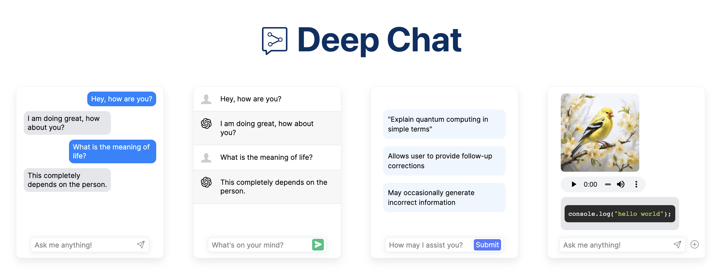

<br />



<b>Deep Chat</b> is a fully customizable chat based web component built with a focus on powering next generation AI services. Whether you want to create a chatbot that leverages popular APIs such as ChatGPT or you want to connect to your own custom service, this component can do it all! Explore [deepchat.dev](https://deepchat.dev/) to view all of the available features, how to use them, examples and more!

### :rocket: Main Features

- Connect to any API
- Avatars
- Names
- Send/Receive files
- Capture photos via webcam
- Record audio via microphone
- Speech To Text for message input
- Text To Speech to hear message responses
- Support for MarkDown to structure text and render code
- Introduction panel to help describe the chat to your users
- Modals triggered via buttons to help inform their functionality
- Connect to popoular AI APIs such as OpenAI, HuggingFace, Azure directly from the browser
- Everything is customizable!

### :computer: Getting started

```
npm install deep-chat
```

If using React, install the following instead:

```
npm install deep-chat-react
```

To test the component - simply add the following to your markup:

```
<deep-chat directConnection='{"demo":true}'/>
```

The exact syntax for the above example will vary depending on the framework of your choice ([see here](https://activetable.io/examples/frameworks)).

### :zap: Connect


Connecting to a service is as simple as it gets. All you need to do is define the target API details using the `request` property:

```
<deep-chat request='{"url":"https://www.targetdomain.com"}'/>
```

The target service will need to be able handle a preset request format and send an appropriate response for a successful roundtrip. Please read about this in the [Connect](Connect) section of the documentation and check the [code examples](HERE).

As a quick workaround, you can use the `requestInterceptor` and `responseInterceptor` properties to augment the incoming and outgoing message bodies into the format that suits the target service.

### :electric_plug: Direct connection

If you want to access one of the popular AI APIs directly from the browser without the use of an intermediary service, you can use the `directConnection` property:

```
<deep-chat directConnection='{"openAI":true}'/>
```

You can additionally preload the component with your own key:

```
<deep-chat directConnection='{"openAI":{"key": "key-here"}}'/>
```

Please note that this exposes the API key to the browser and should ONLY be used for prototyping/demo purposes. When ready to go live, please use the `request` property described above with a combination of an [intermediary proxy service](HERE).

### :camera: :microphone: Camera and Microphone

Deep Chat can be used to create new files from within the component. You can use the camera modal to capture photos via the webcam or record audio via the microphone.


You can enable this via the use of the [_camera_](HERE) and [_microphone_](HERE) properties. E.g:

```
<deep-chat camera="true" microphone="true" ...other properties />
```

### :microphone: :sound: Speech

You can use Speech To Text to construct your messages via voice. This has been integrated into the component via the use of the [speech to element] library that facilitates the use of [Web Speech](HERE) (default) and [Azure](JERE) APIs.

You can also use Text To Speech to read out the text response messages via [Web Speech](HERE).

Please read how to enable this functionality [here](HERE).


## :heart: Contributions

Open source is built by the community for the community. All contributions to this project are welcome!
<br> Additionally, if you have any suggestions for enhancements, ideas on how to take the project further or have discovered a bug, do not hesitate to create a new issue ticket and we will look into it as soon as possible!
