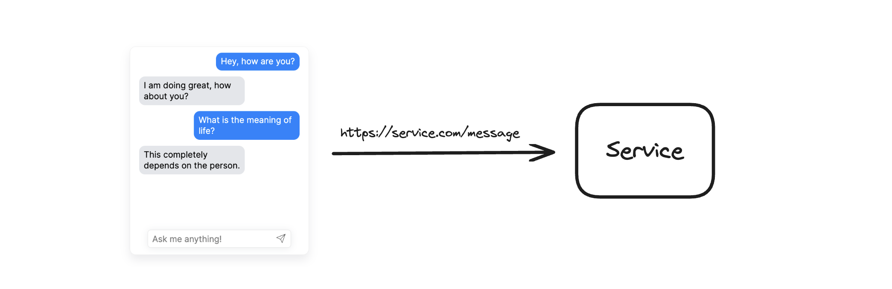
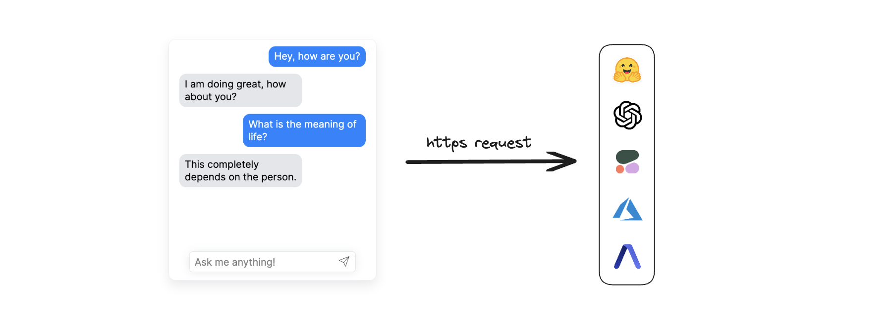
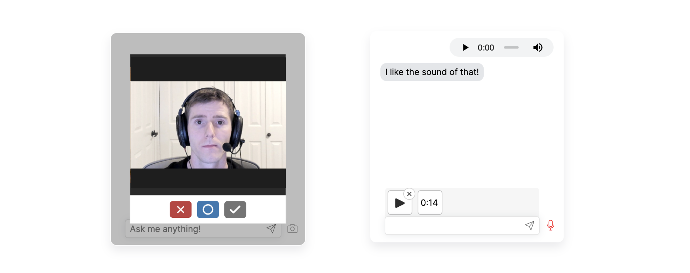

<br />


<b>Deep Chat</b> is a fully customizable chat based web component built with a focus on powering next generation AI services. Whether you want to create a chatbot that leverages popular APIs such as ChatGPT or you want to connect to your own custom service, this component can do it all! Explore [deepchat.dev](https://deepchat.dev/) to view all of the available features, how to use them, examples and more!

### :rocket: Main Features

- Connect to any API
- Avatars
- Names
- Send/Receive files
- Capture photos via webcam
- Record audio via microphone
- Speech To Text for message input
- Text To Speech to hear message responses
- Support for MarkDown to help structure text and render code
- Introduction panel and dynamic modals to describe functionality for your users
- Connect to popular AI APIs such as OpenAI, HuggingFace, Azure directly from the browser
- Support for all major ui frameworks/libraries
- Everything is customizable!

### :computer: Getting started

```
npm install deep-chat
```

If using React, install the following instead:

```
npm install deep-chat-react
```

To test the component - simply add the following to your markup:

```
<deep-chat directConnection='{"demo":true}'/>
```

The exact syntax for the above example will vary depending on the framework of your choice ([see here](https://activetable.io/examples/frameworks)).

### :zap: Connect



Connecting to a service is simple, all you need to do is define its API details using the `request` property:

```
<deep-chat request='{"url":"https://service.com/message"}'/>
```

The service will need to be able to handle request and response formats used in Deep Chat. Please read the [Connect](Connect) section in documentation and check out full [project examples](HERE).

Alternatively, if you want to connect without changing the target service, use the `requestInterceptor` and `responseInterceptor` properties to augment the incoming and outgoing request details.

### :electric_plug: Direct connection



Connect to popular AI APIs directly from the browser via the use of the `directConnection` property:

```
<deep-chat directConnection='{"openAI":true}'/>

<deep-chat directConnection='{"openAI":{"key": "optional-key-here"}}'/>
```

Please note that this approach should ONLY be used for local/prototyping/demo purposes as it exposes the API Key to the browser. When ready to go live, please switch to using the `request` property described above with a combination of an [intermediary proxy service](HERE).

Currently supported AI APIs:
[OpenAI](HERE), [HuggingFace](HERE), [Cohere](HERE), [Azure](HERE), [AssembleAI](HERE)

### :camera: :microphone: Camera and Microphone



Use Deep Chat to capture photos with your webcam and record audio via the microphone. You can enable these features using the [`camera`](HERE) and [`microphone`](HERE) properties:

```
<deep-chat camera="true" microphone="true" ...other properties />
```

### :microphone: :sound: Speech


Input text with your voice using Speech To Text and have the responses read out to you with Text To Speech. You can enable this functionality via the [`speechToText`](HERE) and [`textToSpeech`](HERE) properties. Read more [here](HERE).

```
<deep-chat speechToText="true" microphone="textToSpeech" ...other properties />
```

## :heart: Contributions

Open source is built by the community for the community. All contributions to this project are welcome!
<br> Additionally, if you have any suggestions for enhancements, ideas on how to take the project further or have discovered a bug, do not hesitate to create a new issue ticket and we will look into it as soon as possible!
