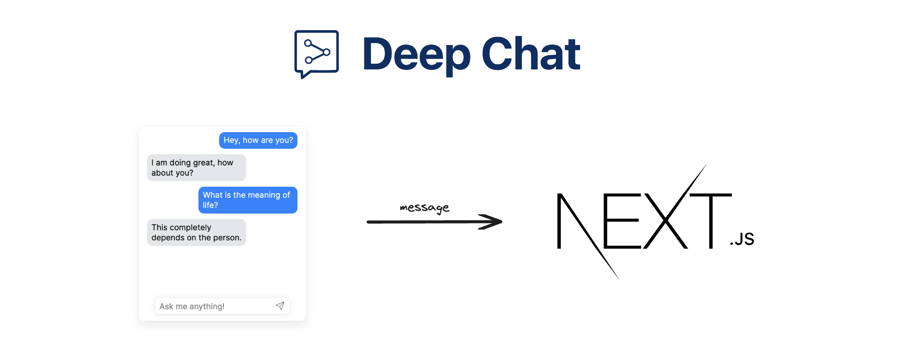

This is an example NextJS [App Router](https://nextjs.org/docs/app) template that can be used to communicate with the [Deep Chat](https://www.npmjs.com/package/deep-chat) component. It includes a variety of endpoints that can be used to host your own service or act as a proxy for the following AI APIs - [OpenAI](https://openai.com/blog/openai-api), [HuggingFace](https://huggingface.co/docs/api-inference/index), [StabilityAI](https://stability.ai/), [Cohere](https://docs.cohere.com/docs).

This project is fully setup and ready to be hosted by a platform such as [Vercel](https://vercel.com/).

### :computer: Local setup

If you are downloading the project via `git clone` - we advise you to use shallow cloning with the use of the [--depth 1](https://www.perforce.com/blog/vcs/git-beyond-basics-using-shallow-clones) option to reduce its size:

```
git clone --depth 1 https://github.com/OvidijusParsiunas/deep-chat.git
```

Navigate to this directory and run the following command to download the dependencies:

```
npm install
```

Run the project:

```
npm run dev
```

If you want to use the proxy functions:

<b>Local</b> - Create a `.env.local` file and define the corresponding environment variables. E.g. if you want to use OpenAI API, define the `OPENAI_API_KEY` variable. See the `.env.example` file.

<b>Hosting Platform</b> - Add the environment variables to your deploy config. E.g. if you want to use the OpenAI Chat, add the `OPENAI_API_KEY` environment variable.

### :wrench: Improvements

If you are experiencing issues with this project or have suggestions on how to improve it, do not hesitate to create a new ticket in [Github issues](https://github.com/OvidijusParsiunas/deep-chat/issues) and we will look into it as soon as possible.
